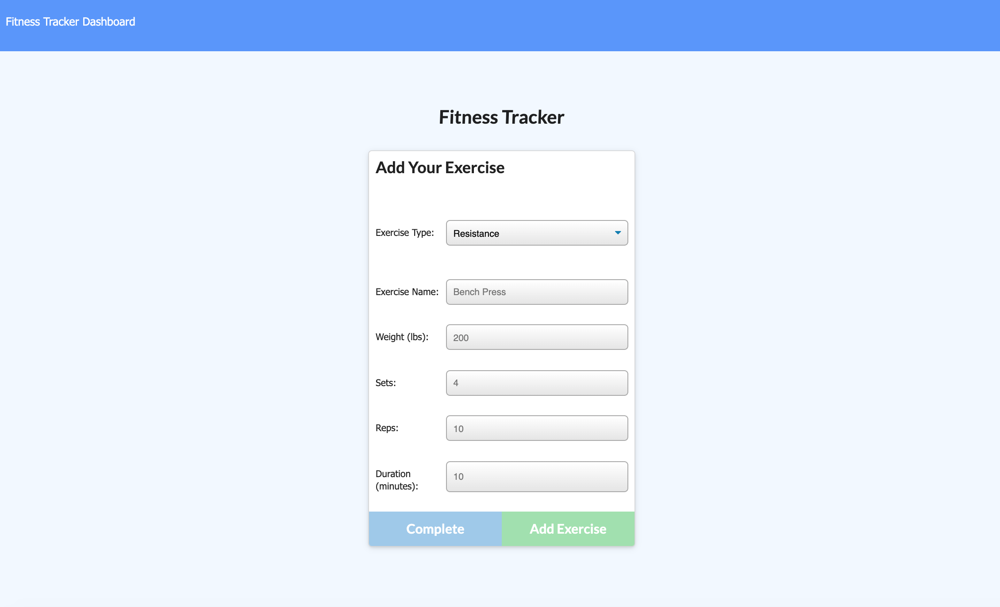
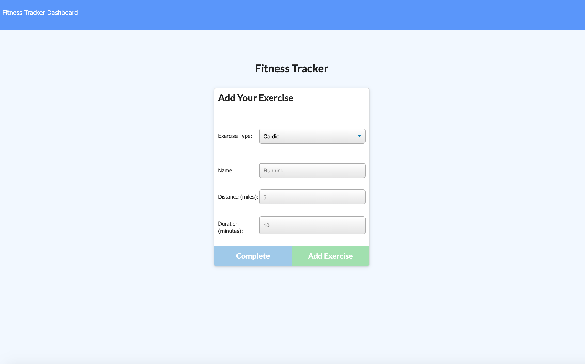
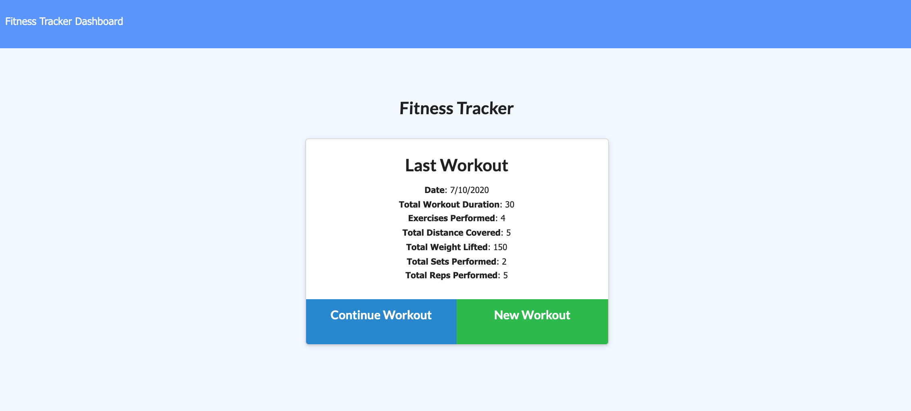
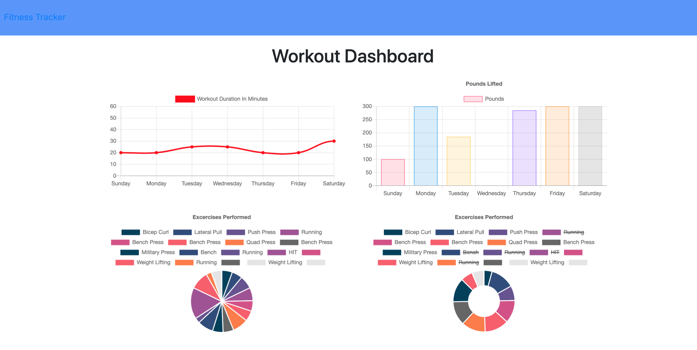

# Workout-Tracker

  

## Table of Contents

* [Link](#link)
* [Description](#description)
* [Installation](#installation)
* [Usage](#usage)
* [Questions](#questions)

## Link

Access the application [here](https://whispering-springs-61005.herokuapp.com/).

## Description

An app that lets you track, create and log your workouts. You can also view all workouts within one week summarized through graphs.

The overall design uses the following:

* `MongooDB`, a document-oriented NoSQL database program
* `mongoose` for running MongoDB-based code
* `node` for running application
* HTML, CSS, JavaScript and jQuery for website design

## Installation

To use this app in your environment:

1. Make sure you are inside the `Develop` folder. In the Terminal, run the command `npm install` to install all the required dependencies.
1. Run the command `run npm seed` to fill the database.
1. Run the command `node server.js` to start the application.
1. Please make sure mongoDB is running.

## Usage

Using the app, you can add either resistance or cardio exercises to your current or previous workout plan. For resistance exercises, you will need to input the fields in the following screenshot:

For cardio exercises, the fields in the following screenshot are required:

You can view your current workout and the stats of all of your exercises as well.

## Questions

For questions or collaborations, please contact me through [GitHub](https://github.com/vxmao87).
